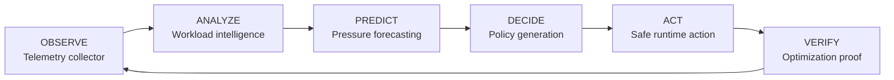
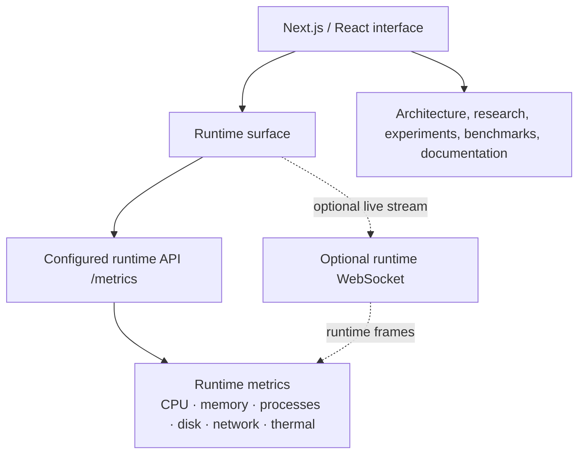

# AstraOS- Intelligence Website
## Autonomous Runtime Intelligence Platform

AstraOS is an AI-native infrastructure intelligence concept organized around a continuous runtime control loop: **Observe → Analyze → Predict → Decide → Act → Verify**. This repository is the public-facing TypeScript/Next.js engineering interface for the broader AstraOS system, presenting its architecture, runtime surfaces, research direction, experiments, documentation, and benchmark methodology.

> **Scope note:** The complete runtime, telemetry pipeline, AI engines, optimization systems, and infrastructure components are maintained separately from this website repository.

### Live System

- **Professional Website:** [astra-os-autonomous-runtime-intelli.vercel.app](https://astra-os-autonomous-runtime-intelli.vercel.app/)
- **Live AstraOS Dashboard:** [astra-os-mu.vercel.app](https://astra-os-mu.vercel.app/)
- **GitHub Repository:** [IamChandu114/AstraOS-Autonomous-Runtime-Intelligence-Platform](https://github.com/IamChandu114/AstraOS-Autonomous-Runtime-Intelligence-Platform)

### The Idea

AstraOS frames runtime intelligence as a closed control loop:

The loop moves from runtime signals to workload and root-cause reasoning, pressure and trend forecasting, risk-aware policy generation, constrained recommendations or actions, and feedback based on observed outcomes.

### What AstraOS Does

The implemented website provides an engineering surface for:

- Runtime connectivity and status states: `LIVE`, `CONNECTING`, `OFFLINE`, and `DEGRADED`.
- Runtime metric retrieval through a configurable API endpoint and optional WebSocket integration.
- Dashboard panels for CPU, memory, processes, disk, network, and thermal signals.
- Architecture mapping across applications, the AstraOS runtime, telemetry, AI intelligence, policy, optimization, host observability, kernel, and hardware layers.
- Dedicated runtime, architecture, experiments, research, benchmark, articles, and documentation surfaces.
- Evidence-oriented presentation of implementation status, experiments, and benchmark methodology.

### Architecture

The public interface maps the broader system as a layered control plane. Components that are not implemented in this repository are explicitly represented as experimental, planned, adapter-dependent, or host-dependent rather than presented as shipped website functionality.

### Engineering

The project communicates the following systems-engineering areas, with implementation status kept explicit:

- **Runtime telemetry:** Runtime-facing metric retrieval and panels for core host signals are supported by the website integration; the underlying collector is maintained separately.
- **Workload intelligence:** The architecture and control-loop surfaces describe workload classification and root-cause signals as part of the broader AstraOS design.
- **Prediction and forecasting:** Pressure, thermal, and resource-trend forecasting are presented as the predictive stage of the system.
- **Constrained optimization:** Risk-aware policy generation and optimization planning are described with explicit constraints and safety limits; the optimization engine is marked planned in the architecture surface.
- **Guarded actions:** Runtime action is framed as safe, recommendation-oriented execution with constraints rather than unrestricted automation.
- **Verification and proof:** The control loop includes optimization proof and feedback; the website exposes this as an evidence-oriented engineering concern.
- **Benchmarking:** A dedicated benchmark surface presents evidence-first methodology and measured evaluation as the standard for claims.
- **Observability and reliability:** Runtime connectivity is represented as an actual state with offline, degraded, and connecting conditions, while the architecture includes telemetry, host observability, reliability, and verification concerns.

### Evidence

AstraOS treats benchmark results and optimization proof as first-class evidence rather than decoration. This repository contains the benchmark and experiments presentation surfaces, but it does **not** contain the complete runtime benchmark implementation or a published numeric optimization result; those belong to the separately maintained AstraOS system. No performance metric is claimed here beyond what is measured and published by that system.

### Production

The professional website is deployed at [astra-os-autonomous-runtime-intelli.vercel.app](https://astra-os-autonomous-runtime-intelli.vercel.app/). A separate live dashboard is available at [astra-os-mu.vercel.app](https://astra-os-mu.vercel.app/), subject to runtime endpoint configuration and availability.

### Research Direction

AstraOS is directed toward predictive runtime optimization: combining telemetry, workload reasoning, forecasting, policy constraints, runtime control, and post-action verification. The near-term engineering direction is to make infrastructure decisions more observable, explainable, measurable, and safe under real host and workload conditions.

### Engineering Principles

- **Observable** — decisions begin with runtime state and measurable signals.
- **Constrained** — policies and actions operate within explicit safety boundaries.
- **Measurable** — claims are tied to experiments, benchmarks, and recorded outcomes.
- **Verifiable** — actions require feedback and evidence of impact.
- **Evidence-driven** — architecture and capability status distinguish implemented, experimental, planned, and host-dependent areas.
- **Fail-safe** — unavailable or degraded runtime connections are represented explicitly rather than hidden.

### Limitations

- This repository is the professional website, not the complete AstraOS runtime.
- Several architecture layers depend on separate runtime services, host adapters, Linux capabilities, or hardware-specific integrations.
- Runtime data is unavailable unless the configured API or WebSocket endpoints are reachable.
- The website alone cannot establish production readiness, autonomous operation, or general optimization gains.
- Benchmark conclusions require reproducible workloads, controlled environments, and published measurements from the separately maintained runtime implementation.

### Author

**Chandu Vemula**  
GitHub: [github.com/IamChandu114](https://github.com/IamChandu114)
